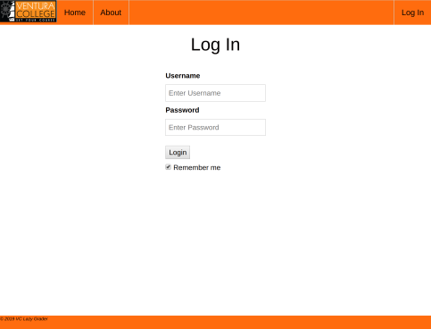
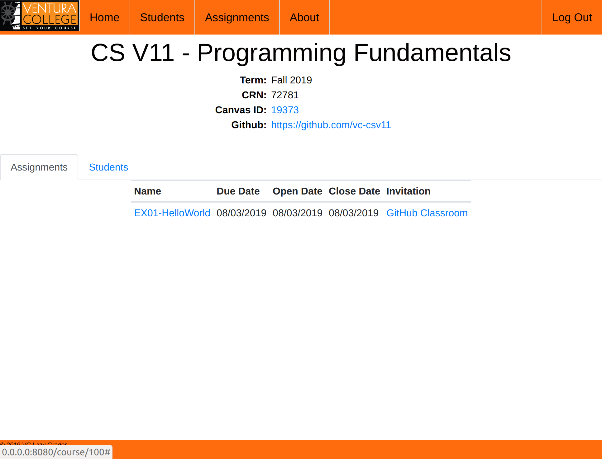
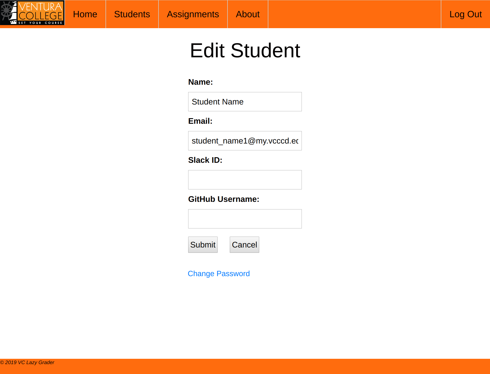

## EX00-LazyGrader
Setting up your account in LazyGrader

### Overview

The purpose of this assignment is to get all the accounts created that
are necessary to complete and turn-in assignments for this course. 

After completing this assignment you should be able to start, complete
and even submit grades for each of the programming assignments in this
class. In addition, you will also be able to communicate with me, the
instructor, and other students using the chat application Slacker.

Follow the directions below to complete this assignment. If you do
not complete each stage correctly, it may be possible that you cannot
turn in assignments in the future, so take care to understand what
you are doing and ask questions if you're not sure.

### LazyGrader

LazyGrader is a new application that my son and I created over the 
summer. Its purpose is to provide students with more transparency into
how each of their assignments is doing when being compiled and tested
for grading purposes. It also allows the student to submit a grade when
the student is ready. Once they've submitted the grade it immediately
puts that grade in Canvas. There will be no more need to wait for the
instructor to run, grade and submit scores to canvas. As soon as you 
are done coding the assignment and have a successful build, you can
get a grade submitted to canvas. We will go over how to use LazyGrader
more in the near future. For now you goal is to give it all the 
information it needs to work correctly.

Everybody has already been given an account with a default password.
In order to start this assignment, go to 
[https://www.vc-computerscience.club](https://www.vc-computerscience.club). There you should be greeted
by a login similar to the following screenshot:

Your username is your MyVCCCD email address. If you don't know it, log into the VCCCD website and
find it. Your password is your 900 student number. This number starts with 900 and is 9 digits long.
As part of this assignment you will change this to a password of your choosing. For now, login using
this default password.

Once you've logged in you should go to the home screen with a list of all the courses you are 
enrolled in with me. That screen should look something like the following screenshot:

Next, you will need to update your user information to allow LazyGrader to work correctly and to
change your password from the default. You will need to create accounts for GitHub (unless your
already have one) and for Slack. Directions for creating those services are given below. Please 
follow them to get the user IDs need for LazyGrader.

Go to the user page and click edit. Fill in your GitHub username and Slack username. Also, change
your password and confirm this change by entering it twice as directed on the screen. This page
should look similar to the following screenshot:

Once you have filled in all the information, click 'Submit' to save your information. Then, click
on 'Change Password' to enter new password. In order to get full credit for this assignment, you
must change your password. 

As a quick 
test, to verify that your password change is correct, Click 'Sign Out' in the upper right corner
and relog in with the password you just created. I will grade this assignment by checking that 
your have entered your GitHub and Slack username and that your default password not longer allows
me to login to your account.

### GitHub

To submit your code for grading on all programming assignments you will need a GitHub account. If
you already have one, you can skip the rest of this section. There is no requirement as to the
naming of the account or the email address associated with it, so you can use any pre-existing
username for GitHub.

If you have never used GitHub and do not already have an account, go to 
[GitHub](https://www.github.com){:target="_blank"}. You should see a screen that looks similar to this screenshot:
 

Fill-in the information requested (username, email address and password), and then click 
'Sign up for GitHub'. That should be enough
 
Alternatively, you can click the 'Sign Up' button in the upper right of the page, and follow the
directions there. 

Either way, when you're done make sure you can log in to GitHub with your newly created account
name and then submit it to LazyGrader.

### Slack

In order to support students, we use a chat program called slack. It is similar to Discord, but 
is widely used in the software and technology fields for team communication. You can use this app
to get help from your fellow students and from me for anything in the course. 

Be aware: all communications in this application are recorded and logged. Please be respectful to
each other. I have never had a problem with students misbehaving on this application, but if they
do, I have no problem turning over the logs to the proper entities investigating misconduct.

To create your account for this application, go to [https://vc-csv11-fall2019.slack.com](https://vc-csv11-fall2019.slack.com).
 
